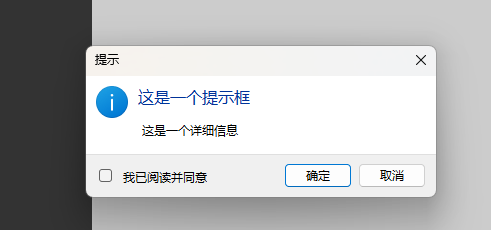
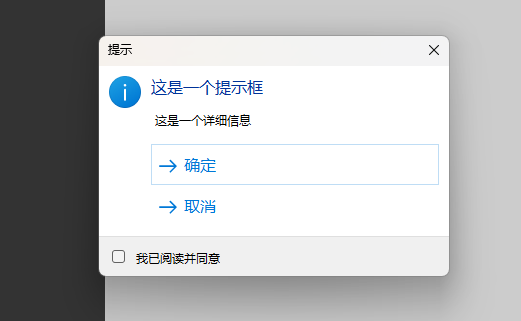
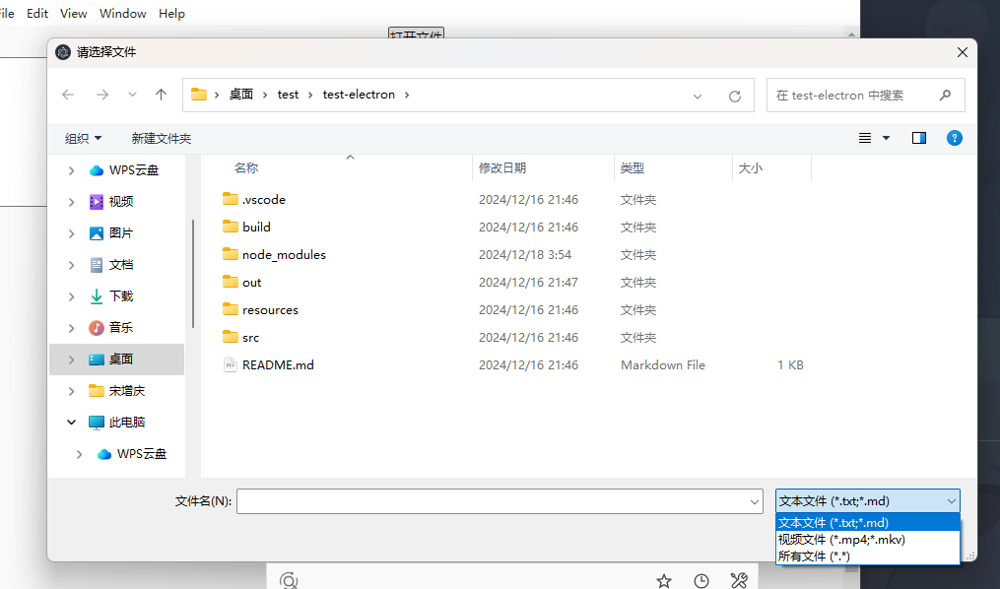

# electron

electron 官网：https://www.electronjs.org/zh/

electron-vite 官网：https://cn-evite.netlify.app/

## 安装依赖

初始化项目

```bash
npm create @quick-start/electron@latest
```

操作本地数据库

```bash
npm i sqlite3
```

安装依赖，配置跟写 vue 一样，记得配路由出口

```bash
npm i element-plus vue-router@4
```

## 配置 @ 通配符

electron.vite.config.mjs

```js
  renderer: {
    resolve: {
      alias: {
        '@': resolve('src/renderer/src')
      }
    },
    plugins: [vue()],
  }
```

## 打开调试控制台

src/main/index.js

```js
const NODE_ENV = process.env.NODE_ENV || 'development'
if (NODE_ENV === 'development') {
  mainWindow.webContents.openDevTools()
}
```

## 将主窗口 mainWindow 放到全局

src/main/index.js

```js
//主窗口
let mainWindow = null

function createWindow() {
  mainWindow = new BrowserWindow({...})
}
```

## 关闭时将应用隐藏到托盘

src/main/index.js

```js
function createWindow() {
  ...
  mainWindow.on('close', (e) => {
    e.preventDefault()
    mainWindow.hide()
  })

  mainWindow.on('closed', () => {
    mainWindow = null
  })
}
```

## 设置可拖拽区域

给某个区域设置可拖拽，比如窗口的标题栏

如果可拖拽区域有按钮，那么按钮无法点击，需要给按钮设置不可拖拽

```css
-webkit-app-region: drag; //可拖拽
-webkit-app-region: no-drag; //不可拖拽
```

## 获取触发来源的窗口（父窗口）

主进程与渲染进程通信的时候，会拿到事件 `e`

```js
//BrowserWindow.fromWebContents可以找到窗口
//e.sender触发来源
BrowserWindow.fromWebContents(e.sender) //获取触发来源的窗口，即主窗口，父窗口
```

## 初始化配置

src/main/index.js

```js
const login_width = 300
const login_height = 370

function createWindow() {
  const mainWindow = new BrowserWindow({
    icon, //设置图标
    width: login_width,
    height: login_height,
    show: false, //默认最小化到后台
    autoHideMenuBar: false, //顶部的菜单栏
    titleBarStyle: 'hidden', //放大缩小全屏按钮
    resizable: false, //禁止缩放
    frame: true, //无边框，自带的最大化最小化也会消失
    transparent: true, //背景透明
    webPreferences: {
      preload: join(__dirname, '../preload/index.js'),
      sandbox: false,
      contextIsolation: false,
    },
  })
}
```

## 主进程与渲染进程通信

- 这个过程是异步的

- 主进程的消息在 vscood 中查看

- 渲染进程的消息在调试控制台查看

### 关闭上下文隔离

关闭之后，两种方式都通过`window.xxx`访问

#### 第一种方式，直接关闭上下文隔离

src/main/index.js

```js{6,7}
function createWindow() {
  const mainWindow = new BrowserWindow({
    ...,
    webPreferences: {
     ...,
      nodeIntegration:true, //允许使用node
      contextIsolation: false //关闭上下文隔离
    }
  })
}
```

src/preload/index.js

```js
import { ipcRenderer } from 'electron'
window.ipcRenderer = ipcRenderer
```

#### 第二种方式，通过 contextBridge 暴露

src/preload/index.js

```js
import { contextBridge, ipcRenderer } from 'electron'
contextBridge.exposeInMainWorld('ipcRenderer', ipcRenderer)
```

### invoke,handle(推荐) 双向通信

```js
const handleSend = async () => {
  //渲染进程发送消息，然后接收消息
  const result = await window.ipcRenderer.invoke('send-message', 'hello world')
  console.log('接收消息', result)
}
```

```js
//主进程监听消息，然后发送消息
ipcMain.handle('send-message', (e, data) => {
  console.log('收到send-message发送的消息', data)
  return '主进程收到消息'
})
```

### send,on 单向通信

```js
const handleSend = () => {
  //渲染进程发送消息，然后接收消息
  window.ipcRenderer.send('send-message', 'hello')
  window.ipcRenderer.on('reply-message', (e, data) => {
    console.log('主进程返回了消息')
  })
}
```

```js
//主进程监听消息，然后发送消息
ipcMain.on('send-message', (e, data) => {
  console.log('收到send-message发送的消息', data)
  e.sender.send('reply-message', '我收到了你的消息')
})
```

### 案例

#### 通信封装

src/preload/index.js

```js
import { contextBridge, ipcRenderer } from 'electron'
contextBridge.exposeInMainWorld('electronApi', {
  invokeMsg: (key, message) => {
    return ipcRenderer.invoke(key, message)
  },
})
```

使用

src/main/index.js

```js
ipcMain.handle('send', (e, data) => {
  console.log('收到渲染进程发送的消息', data)
  return '收到 over'
})
```

渲染进程

```js
const handleSend = async () => {
  const result = await window.electronApi.invokeMsg('send', { id: 1, name: '小花' })
  console.log(result)
}
```

#### 修改窗口配置

```js
mainWindow.setTitle('my first electron') //修改任务栏窗口标题
mainWindow.center() //窗口居中
mainWindow.setMaximizable(true) //可以最大化
mainWindow.setMinimumSize(800, 600) //设置最小窗口大小
mainWindow.minimize() //最小化窗口
mainWindow.maximize() //最大化窗口
mainWindow.restore() //恢复窗口
mainWindow.close() //关闭窗口
```

主进程实例可以使用 mainWindow，还有一种方式

```js
const window = BrowserWindow.getFocusedWindow()
mainWindow.setTitle('my first electron')
window.close()
```

#### 修改窗口大小

主进程监听消息

```js
ipcMain.on('loginOrRegister', (e, login) => {
  mainWindow.setResizable(true) //允许缩放
  if (login) {
    mainWindow.setSize(login_width, register_height) //修改窗口大小
  } else {
    mainWindow.setSize(login_width, register_height)
  }
  mainWindow.center() //窗口居中
  mainWindow.setResizable(false) //禁止缩放
})
```

```js
window.ipcRenderer.send('loginOrRegister', 'true')
```

## 主进程持久化存储

### 安装

- 最新版本为 ESM 语法，使用报错，所以需要指定版本

```bash
npm i electron-store@8.1.0
```

### 存储

新建文件 `src/main/store.js`

```js
const Store = require('electron-store')
const store = new Store()

let userId = null

const initUserId = (_userId) => {
  userId = _userId
}

const getUserId = () => {
  return userId
}

const setData = (key, value) => {
  store.set(key, value)
}

const getData = (key) => {
  return store.get(key)
}

const removeData = (key) => {
  store.delete(key)
}

export { initUserId, getUserId, setData, getData, removeData }
```

### 使用

```js
import store from './store'
store.initUserId(11)
```

## 主题切换

- nativeTheme.shouldUseDarkColors 是否是深色

- nativeTheme.themeSource system 跟随系统 light 浅色 dark 深色

```js{5,10}
import { nativeTheme } from 'electron'
//切换主题
ipcMain.handle('toogle-theme', (e, data) => {
  const theme = nativeTheme.shouldUseDarkColors ? 'light' : 'dark'
  nativeTheme.themeSource = theme
  return theme
})
//跟随系统
ipcMain.handle('system-theme', (e, data) => {
  nativeTheme.themeSource = 'system'
  return 'system'
})
```

加上 css

```css
@media (prefers-color-scheme: dark) {
  body {
    background-color: #333;
    color: #fff;
  }
}

@media (prefers-color-scheme: light) {
  body {
    background-color: #fafafa;
    color: #333;
  }
}
```

## 菜单

### 系统菜单

src/main/index.js

```js
import { Menu, nativeTheme } from 'electron'
//创建应用菜单
function createApplicationMenu() {
  const template = [
    { label: '管理中心' },
    {
      label: '系统管理',
      submenu: [
        { label: '检查更新' },
        { type: 'separator' }, //分割线
        {
          label: '切换主题',
          submenu: [
            {
              label: '深色主题',
              type: 'radio',
              checked: nativeTheme.shouldUseDarkColors,
              click: () => (nativeTheme.themeSource = 'dark'),
            },
            {
              label: '浅色主题',
              type: 'radio',
              checked: !nativeTheme.shouldUseDarkColors,
              click: () => (nativeTheme.themeSource = 'light'),
            },
          ],
        },
      ],
    },
  ]
  const menu = Menu.buildFromTemplate(template) //初始化菜单
  Menu.setApplicationMenu(menu) //设置应用菜单
}
//app准备就绪
app.whenReady().then(() => {
  ...
  createApplicationMenu()
  createWindow()
})
```

### 右键菜单

src/main/index.js

```js
ipcMain.handle('menu:contextmenu', (e, data = []) => {
  const template = [{ label: '刷新', click: () => console.log('main') }, ...data]
  const menu = Menu.buildFromTemplate(template)
  //指定窗口
  //BrowserWindow.fromWebContents可以找到窗口
  //e.sender触发来源
  menu.popup({ window: BrowserWindow.fromWebContents(e.sender) })
})
```

渲染进程

```js
<template>
  <div class="page">
    <div class="sidebar" @contextmenu="handleSidebar">侧边栏</div>
    <div class="main" @contextmenu="handleMain">主体</div>
  </div>
</template>

<script setup>
const handleSidebar = () => {
  window.electronApi.invokeMsg('menu:contextmenu', [{ label: '侧边栏' }])
}
const handleMain = () => {
  window.electronApi.invokeMsg('menu:contextmenu', [{ label: '主体' }])
}
</script>

<style lang="scss" scoped>
.page {
  height: 100vh;
  display: flex;
  .sidebar {
    width: 30%;
    background-color: #333;
  }
  .main {
    width: 70%;
    background-color: #ccc;
  }
}
</style>

```

## 任务栏托盘

src/main/index.js

```js
import { Tray, Menu, nativeImage } from 'electron'
//创建托盘
function createTray() {
  const template = [
    { label: '打开应用', click: () => mainWindow.show() },
    { label: '检查更新' },
    {
      label: '退出',
      click: () => {
        mainWindow.destroy()
        app.quit()
      }
    }
  ]
  const menu = Menu.buildFromTemplate(template)
  const tray = new Tray(icon)
  tray.setTitle('title')
  tray.setToolTip('tooltip')
  tray.setContextMenu(menu)
  // 点击任务栏图标打开应用
  tray.on('click', function () {
    mainWindow.show()
  })
}
//app准备就绪
app.whenReady().then(() => {
  ...
  createWindow()
  createTray()
})
```

## 系统通知

主进程触发通知

```js
import { Notification } from 'electron'
function updateCheck() {
  const options = {
    icon: icon,
    title: '温馨提示',
    body: '发现新版本，点击立即更新！！！',
  }
  const notify = new Notification(options)
  notify.show()
}
//app准备就绪
app.whenReady().then(() => {
  createWindow()
  updateCheck()
})
```

渲染进程触发通知

window 上已经默认引入了 Notification，直接使用即可，不用手动引入

```js
const handleClick = () => {
  const options = {
    body: '发现了新版本',
  }
  const notify = new window.Notification('title', options) //自动触发
  notify.onclick = () => {
    console.log('点击了通知')
  }
}
```

## 快捷键

src/main/index.js

```js
import { globalShortcut } from 'electron'
function registerShortcuts() {
  //CommandOrControl win就是control  mac就是command
  globalShortcut.register('CommandOrControl+Shift+I', () => {
    console.log('7')
    //打开开发者工具
    mainWindow.webContents.openDevTools()
  })
}
//app准备就绪
app.whenReady().then(() => {
  registerShortcuts()
  createWindow()
})
//退出时注销快捷键
app.on('will-quit', () => {
  globalShortcut.unregisterAll()
})
```

## dialog 对话框

### 系统对话框

```js
import { dialog } from 'electron'
ipcMain.handle('dialog', (e, options) => {
  const win = BrowserWindow.fromWebContents(e.sender)
  return dialog.showMessageBox(win, options)
})

const handleClick = async () => {
  const options = {
    type: 'info', //warning error info
    title: '提示',
    message: '这是一个提示框',
    detail: ' 这是一个详细信息',
    checkboxLabel: '我已阅读并同意', //提示选项
    // buttons: ['OK', 'Cancel'], //内置按钮
    buttons: ['确定', '取消'], //自定义按钮
  }
  const result = await window.electronApi.invokeMsg('dialog', options)
  console.log(result)
}
```

内置按钮



自定义按钮



### 选择文件对话框

```js
import { dialog } from 'electron'
import fs from 'fs'
ipcMain.handle('open:dialog', (e, options) => {
  const win = BrowserWindow.fromWebContents(e.sender)
  return dialog.showOpenDialog(win, options)
})
ipcMain.handle('fs:read-file', async (e, filePath) => {
  return await fs.promises.readFile(filePath, 'utf-8')
})

const handleOpenFile = async () => {
  const options = {
    title: '请选择文件',
    properties: ['openFile'], //允许选择文件
    filters: [
      { name: '文本文件', extensions: ['txt', 'md'] },
      { name: '视频文件', extensions: ['mp4', 'mkv'] },
      { name: '所有文件', extensions: ['*'] },
    ],
  }
  const result = await window.electronApi.invokeMsg('open:dialog', options)
  if (result.canceled) {
    return
  }
  const content = await window.electronApi.invokeMsg('fs:read-file', result.filePaths[0])
  console.log(content)
}
```



### 保存文件对话框

```js
import { dialog } from 'electron'
import fs from 'fs'
ipcMain.handle('save:dialog', (e, options) => {
  const win = BrowserWindow.fromWebContents(e.sender)
  return dialog.showSaveDialog(win, options)
})
ipcMain.handle('fs:write-file', async (e, { filePath, data }) => {
  return await fs.promises.writeFile(filePath, data, 'utf-8')
})

const handleSaveFile = async () => {
  const options = {
    title: '保存文件',
    defaultPath: '新建文件.txt', // 默认文件名
    buttonLabel: '保存',
    filters: [
      { name: '文本文件', extensions: ['txt', 'md'] },
      { name: '视频文件', extensions: ['mp4', 'mkv'] },
      { name: '所有文件', extensions: ['*'] },
    ],
  }
  const result = await window.electronApi.invokeMsg('save:dialog', options)
  if (result.canceled) {
    return
  }
  const content = 'aaa'
  await window.electronApi.invokeMsg('fs:write-file', { filePath: result.filePath, data: content })
}
```


### 使用默认路径

```js
app.getPath('documents') //获取用户文档路径
```

## 在线离线 状态监测

```js
function refreshStatus() {
  const status = navigator.onLine ? '在线' : '离线'
  window.electronApi.invokeMsg('network:status', navigator.onLine)
}
window.addEventListener('online', refreshStatus)
window.addEventListener('offline', refreshStatus)

//主进程监听网络状态，修改托盘图标为 彩色/黑白
ipcMain.handle('network:status', (e, status) => {
  tray.setImage(status ? onlineIcon : offlineIcon)
})
```

## 多窗口

### 显示加载窗口

应用同时创建加载窗口和主窗口，主窗口加载完成之后发送消息给主进程，主进程关闭加载窗口并显示主窗口。

src/main/index.js

```js
import { app, shell, BrowserWindow, ipcMain } from 'electron'
import { join } from 'path'
import { electronApp, optimizer, is } from '@electron-toolkit/utils'
import icon from '../../resources/icon.png?asset'

let mainWindow = null
let loadingWindow = null

function createWindow(options = {}, url = null) {
  const defaultOptions = {
    width: 900,
    height: 670,
    webPreferences: {
      preload: join(__dirname, '../preload/index.js'),
      nodeIntegration: true,
    },
  }
  options = Object.assign(defaultOptions, options)
  const window = new BrowserWindow(options)

  window.webContents.setWindowOpenHandler((details) => {
    shell.openExternal(details.url)
    return { action: 'deny' }
  })

  if (is.dev && process.env['ELECTRON_RENDERER_URL']) {
    window.loadURL(process.env['ELECTRON_RENDERER_URL'])
  } else {
    window.loadFile(join(__dirname, '../renderer/index.html'))
  }

  if (is.dev && url) {
    window.loadFile(join(__dirname, url))
  }

  return window
}

function createMainWindow() {
  const options = {
    width: 900,
    height: 670,
  }
  mainWindow = createWindow(options)
}

function createLoadingWindow() {
  const options = {
    width: 400,
    height: 300,
    show: false,
  }
  const url = '../../src/renderer/loading.html'
  loadingWindow = createWindow(options, url)
}

app.whenReady().then(() => {
  electronApp.setAppUserModelId('com.electron')

  createLoadingWindow()
  createMainWindow()

  app.on('activate', function () {
    if (BrowserWindow.getAllWindows().length === 0) createMainWindow()
  })
})

app.on('window-all-closed', () => {
  if (process.platform !== 'darwin') {
    app.quit()
  }
})

ipcMain.handle('loading-done', () => {
  loadingWindow.close()
  mainWindow.show()
})
```

渲染进程

```js
setTimeout(() => {
  window.electronApi.invokeMsg('loading-done')
}, 5000)
```

### 父子窗口

```js
//用到了上面的显示加载窗口封装的createWindow
ipcMain.handle('createWindow', (e, { options, url }) => {
  const window = BrowserWindow.fromWebContents(e.sender)
  options.parent = window //设置父窗口
  createWindow(options, url)
})

const handleClick = () => {
  const options = {
    width: 400,
    height: 300,
    modal: true, //弹出窗口后不允许操作主窗口
  }
  window.electronApi.invokeMsg('createWindow', { options, url: '../../src/renderer/add.html' })
}
```

### 阻止窗口关闭

```js
//confirm 关闭时是否需要提示
ipcMain.handle('createWindow', (e, { options, url, confirm }) => {
  const win = createWindow(options, url)
  if (confirm) {
    win.on('close', (event) => {
      event.preventDefault()
      //提示
      win.destroy()
    })
  }
})
```

## 遇到问题

### 无法使用 scss

```
npm i sass sass-loader
```

### 控制台报错

报错信息：

```bash
Deprecation Warning: The legacy JS API is deprecated and will be removed in Dart Sass 2.0.0.

More info: https://sass-lang.com/d/legacy-js-api
```

electron.vite.config.mjs

```js
renderer: {
  css: {
    preprocessorOptions: {
      scss: {
        silenceDeprecations: ['legacy-js-api']
      }
    }
  }
}
```

### 控制台中文乱码

```json
"scripts": {
  "dev": "chcp 65001 && electron-vite dev",
},
```

### 高度 100vh 出现滚动条

设置默认样式

```css
* {
  margin: 0;
  padding: 0;
}
html,
body {
  height: 100%;
}
```
