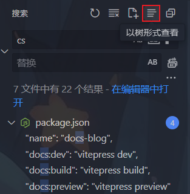
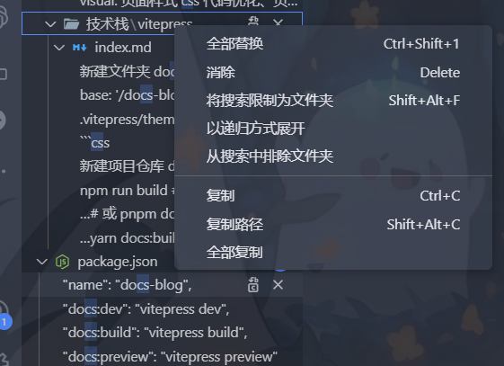
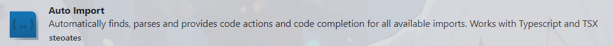
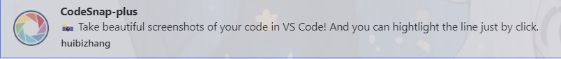
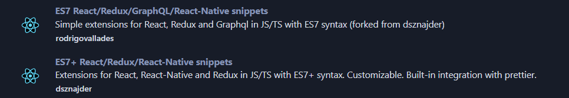
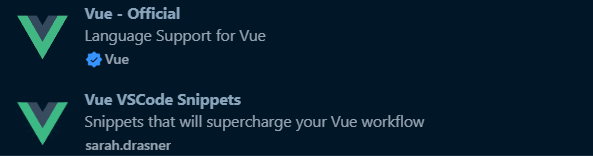
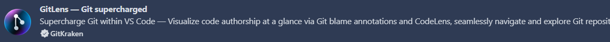
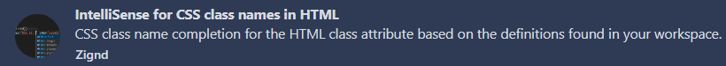

# vscood 系列

## 使用技巧

### 搜索技巧

以树形查看

缩小搜索范围（树形）

### 快捷键

## 插件

### 别名路径跳转

ctrl+单击实现跳转

### 路径补全

### 鼠标移入自动翻译

### 中文插件

### 编辑器高亮主题

### 编辑器暗色主题

### 编辑器暗色主题

### 编辑器高亮+暗色主题

### 自动导入

### 设置编辑器背景图片

### 修复由于编辑器背景图片修改引起的 打开编辑器会出现一个警告

### 截图插件

### 编辑器直接查看颜色

### 隐藏 node_modules 文件夹

点击左下角 Node_Modules 按钮即可显示/隐藏

### 图片预览

### Live Server 启动开发环境服务器

### 本地启动默认服务器

### 文件夹图标

### Project Manager 项目管理器

### 练习 ts

安装后左侧侧边栏会出现一个菜单

### prisma 数据库

### css 跳转

### DotENV 环境变量

### Easy Less 快速编写 less 变量

### Error Lens 错误提示

### React 插件

### vue 插件

### 代码提示插件

### 操作 git

### css 代码提示

### es6 代码提示

### js 和 ts 代码高亮

### 代码格式化

### ts 错误提示

