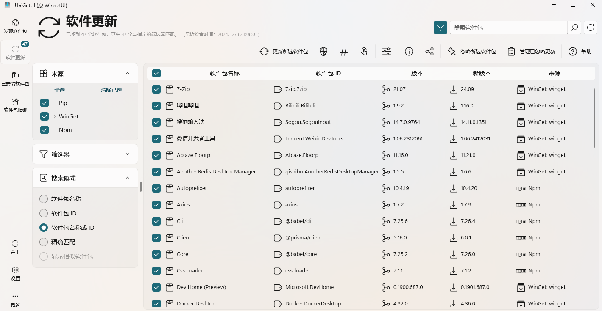

# 常用软件

## vscoode

https://code.visualstudio.com/

## nvm

https://github.com/coreybutler/nvm-windows/releases

## git

git 下载过慢建议使用`迅雷`下载

https://git-scm.com/downloads/win

## 迅雷

https://www.xunlei.com/

## Hbuilder

https://www.dcloud.io/hbuilderx.html

## 微信开发者工具

https://developers.weixin.qq.com/miniprogram/dev/devtools/download.html

## Sublime Text

https://www.sublimetext.com/

## Snipaste

https://www.Snipaste.com/

## uTools

https://u.tools/

## UniGetUI

https://github.com/marticliment/UniGetUI

## Brave 浏览器

（需要科学上网）

https://brave.com/zh/

## Floorp 浏览器

https://floorp.app/en/download
