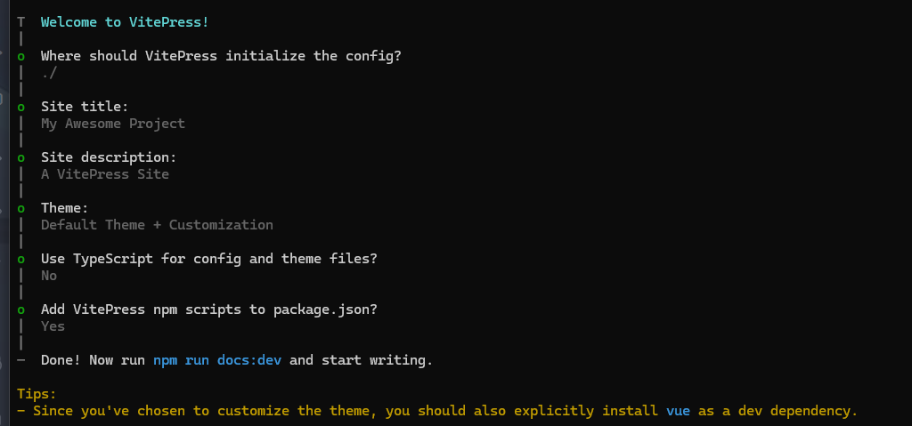

# VitePress

官网地址：https://vitepress.dev/zh/

## 开始

新建文件夹 docs-blog，在文件夹中初始化依赖文件：

```bash
npm init -y
```

初始化 VitePress

```bash
npx init vitepress
```



修改依赖

```json
  "scripts": {
    "dev": "vitepress dev",
    "build": "vitepress build",
    "preview": "vitepress preview",
  },
```

修改文件目录

::: info
根目录下新建 src 文件夹（存放页面）、public 文件夹（存放静态资源、图片）

将`index.md` `api-examples.md` `markdown-examples.md`移动至`src`文件夹下
:::

## 修改配置文件

## 目录结构

```
docs-blog
├── .gitignore
├── node_modules
├── package-lock.json
├── package.json
├── public
│   └── vite.svg
├── src
│   ├── .vitepress
```
