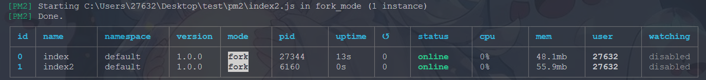
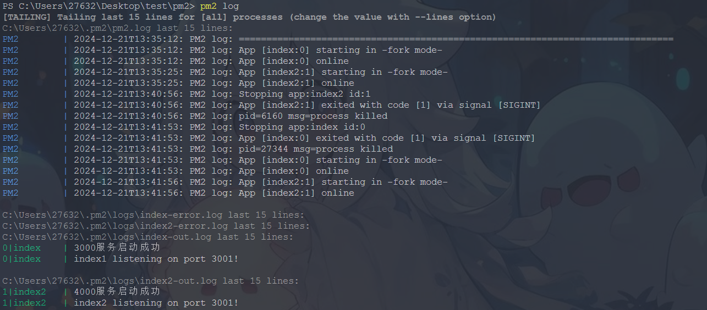
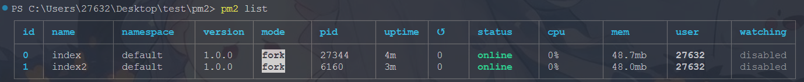
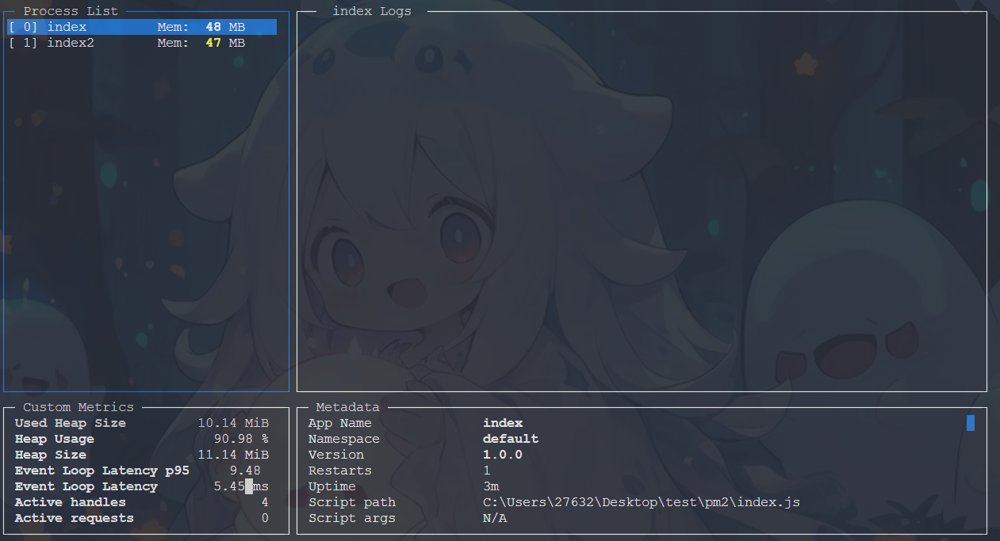

# PM2

PM2 是 Node.js 进程管理工具，可以用来管理 Node.js 应用，包括启动、停止、重启、监控、负载均衡等。

## 安装

```bash
npm install pm2 -g
```

## 常用命令

### 启动应用

- --watch 监听文件变化并自动重启应用
- -n app-name 应用名称

```bash
pm2 start index.js --watch -n app-name
```



### 查看日志

```bash
pm2 log
```



### 查看进程列表

```bash
pm2 list
```



### 停止应用

```bash
pm2 stop [id|name]
```

### 重启应用

```bash
pm2 restart [id|name]
```

### 删除应用

```bash
pm2 delete [id|name]
```

### 监控应用

```bash
pm2 monit
```


